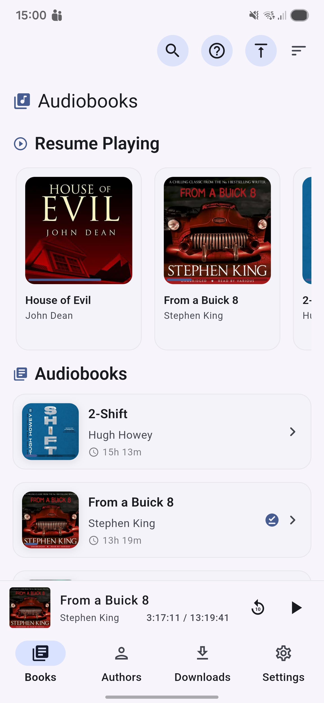
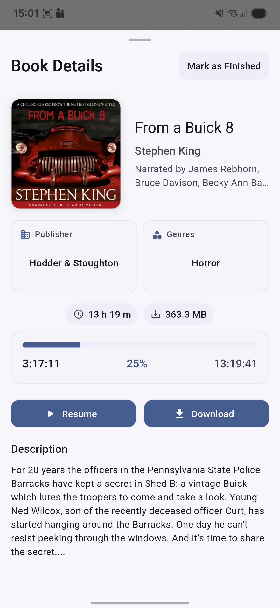
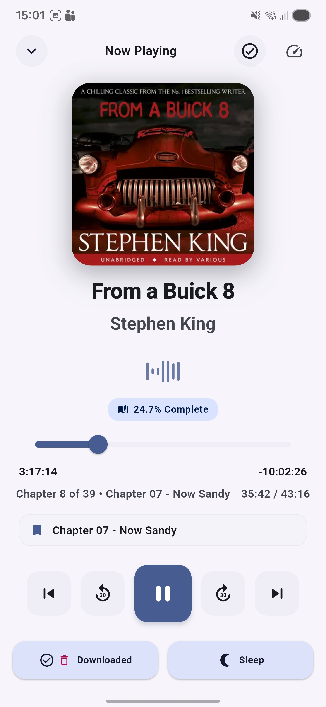
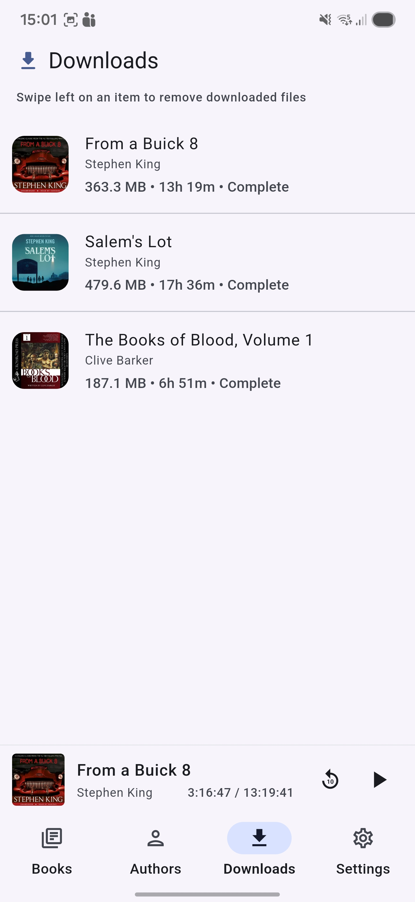

# Kitzi ABS Player

A comprehensive Android client for Audiobookshelf servers, designed for audiobook enthusiasts who want full control over their listening experience.

## Overview

Kitzi ABS Player transforms your audiobook listening experience by providing seamless access to your entire Audiobookshelf library. Whether you're commuting, exercising, or relaxing at home, enjoy professional-grade features with a clean, intuitive interface.

## Features

### Complete Audiobookshelf Integration
- Direct connection to your personal Audiobookshelf server
- Access your entire audiobook and podcast library
- Sync reading progress across all devices
- Support for multiple user accounts and libraries
- Custom HTTP headers support for Zero-Trust access models (Cloudflare Access, etc.)

### Advanced Audio Playback
- High-quality audio streaming and offline playback
- Background playback with comprehensive lock screen controls
- Android Auto support for hands-free listening
- Customizable playback speed (0.5x to 3x)
- Sleep timer with flexible duration options
- Smart rewind feature that adjusts based on pause duration
- Chapter navigation with visual progress indicators
- Configurable primary progress display (full book or current chapter)

### Smart Download Management
- Download audiobooks for offline listening
- Intelligent download queue management
- WiFi-only download option to save cellular data
- Progress tracking and resume capabilities
- Automatic cleanup of orphaned downloads

### Intuitive User Interface
- Clean, modern Material Design 3 interface
- Easy library browsing with search functionality
- Multiple view modes: Books, Series, Authors
- Alphabetical letter scrolling for quick navigation
- Bookmark and progress tracking
- Dark mode support with customizable surface tint levels
- Waveform animation for supported devices
- Dual progress indicators (book and chapter)

### Privacy & Security
- Direct connection to your server - no data collection
- Secure authentication with token management
- Local storage for offline content
- No third-party data sharing

## Screenshots

*Main library view with books and series*

*Full-screen player with progress controls*

*Series browsing with book covers*

*Comprehensive settings and preferences*

## Installation

### Google Play Store
Download directly from the [Google Play Store](https://play.google.com/store/apps/details?id=com.bennybar.kitzi).

### GitHub Releases
Download the latest APK from [GitHub Releases](https://github.com/bennybar/kitzi_abs_player/releases).

## Requirements

- Android 9.0 (API level 28) or higher
- An Audiobookshelf server instance
- Network connectivity (for streaming) or downloaded content (for offline playback)

## Getting Started

1. **Install the app** from the Play Store or GitHub Releases
2. **Connect to your server** by entering your Audiobookshelf server URL
3. **Log in** with your Audiobookshelf credentials
4. **Start listening** - your library will sync automatically

### Android Auto Setup

To use Kitzi ABS Player with Android Auto:

1. Open the Android Auto app on your phone
2. Tap the settings icon (gear)
3. Scroll to the bottom and tap "Version" repeatedly (about 10 times) to unlock developer settings
4. Confirm the prompt to enable developer mode
5. Tap the three-dots menu in the top-right corner
6. Select "Unknown sources" from developer settings
7. Activate the toggle to allow apps from unknown sources

## Configuration

### Custom HTTP Headers

For users behind Zero-Trust proxies (e.g., Cloudflare Access), you can configure custom HTTP headers in Settings > Server access > Custom HTTP headers. This allows the app to authenticate with service tokens required by your proxy configuration.

### Progress Display

Choose your preferred progress metric in Settings > Playback > Primary progress display:
- **Full book**: Shows progress across the entire audiobook
- **Current chapter**: Shows progress within the current chapter only

This setting affects both the full-screen player and the notification/lock screen progress bar.

## Technical Details

- Built with Flutter
- Uses `just_audio` for playback
- `audio_service` for Android media session integration
- `background_downloader` for download management
- SQLite for local caching and offline support

## Privacy

Kitzi ABS Player respects your privacy:
- No analytics or tracking
- No data collection
- Direct connection to your server only
- All data stored locally on your device
- Secure token storage using Android's secure storage

## Support

- **Issues**: Report bugs or request features on [GitHub Issues](https://github.com/bennybar/kitzi_abs_player/issues)
- **Email**: kitzi@ibarak.org

## License

This project is open source. See the repository for license details.

## Acknowledgments

Built for the Audiobookshelf community. Special thanks to contributors and the Audiobookshelf project.

---

**Download**: [Google Play Store](https://play.google.com/store/apps/details?id=com.bennybar.kitzi) | [GitHub Releases](https://github.com/bennybar/kitzi_abs_player/releases)
