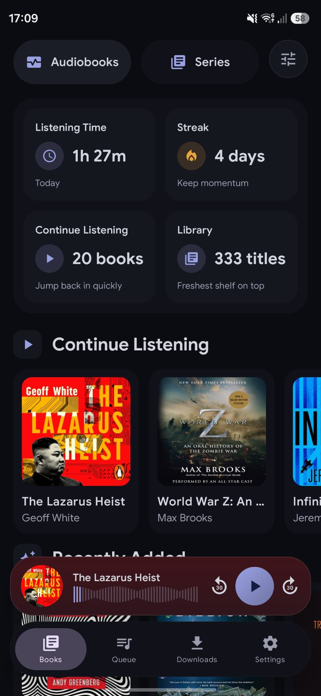
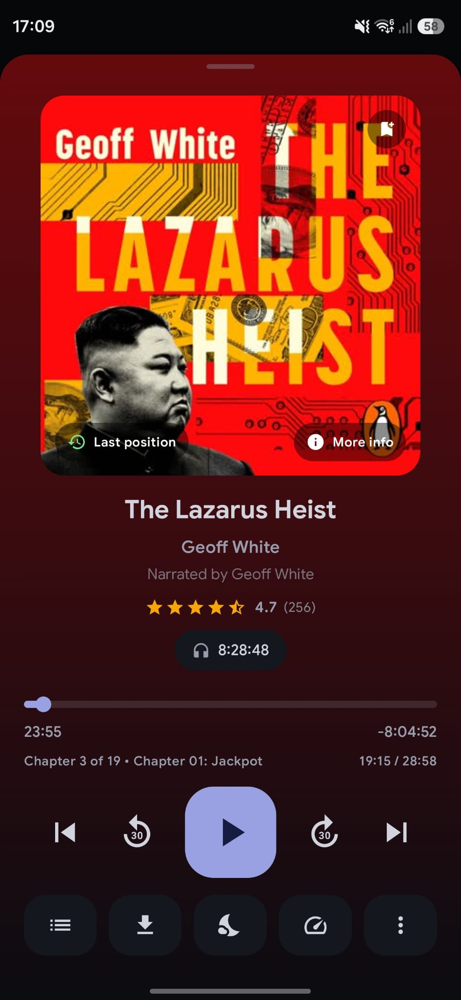
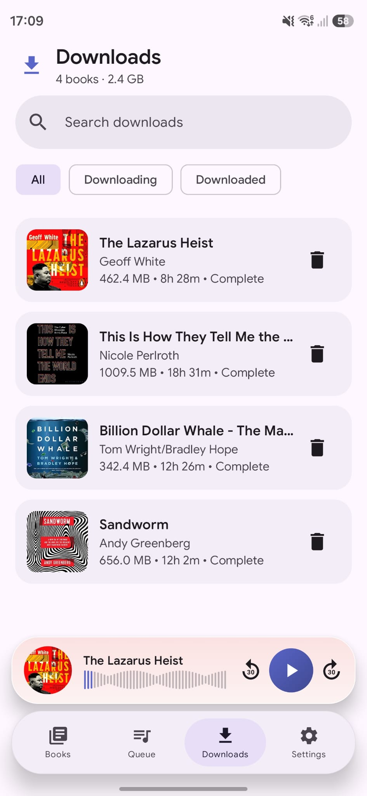

# Kitzi

A native Android player for [Audiobookshelf](https://www.audiobookshelf.org/). Point it at your own ABS server, sign in, and listen — streaming or offline.

[](https://play.google.com/store/apps/details?id=com.bennybar.kitzi&hl=en_US)
[](https://github.com/bennybar/kitzi_abs_player/releases/latest)

Kitzi started life as a Flutter app and was rebuilt from the ground up in Kotlin and Jetpack Compose. It installs as a drop-in update over the old build: same account, same downloads, same listening progress.

This is an unofficial client and isn't affiliated with the Audiobookshelf project.

## Screenshots

| Library | Player | Downloads |
|:---:|:---:|:---:|
|  |  |  |

## What it does

- Streams from your server, or downloads books for offline listening
- Keeps your place in sync with the server, and resumes wherever you left off — even across devices
- Chapter navigation, variable speed (0.75x–2x), configurable skip intervals, and a sleep timer
- Bookmarks, per-book play history, and listening stats
- Browse by library, series, authors, and collections
- Smart rewind on resume, so you don't lose the thread after a pause
- Lock-screen and notification controls with chapter skip and seek, plus Samsung Now Bar support
- Android Auto browse and playback
- Audible star ratings on book detail pages
- Light and dark themes that follow the system

## Requirements

- Android 9 (API 28) or newer
- An Audiobookshelf server you can reach (local, remote, or behind a reverse proxy). Username/password and OIDC/SSO logins are both supported.

## Install

Install it from [Google Play](https://play.google.com/store/apps/details?id=com.bennybar.kitzi&hl=en_US), or grab the latest `app-release.apk` from the [Releases](https://github.com/bennybar/kitzi_abs_player/releases/latest) page and install it directly (you'll need to allow installs from your browser or file manager the first time).

For the sideloaded route, the easiest way to stay up to date is [Obtainium](https://github.com/ImranR98/Obtainium): add this repo as a source and it will watch the Releases page and install new versions as they land, no store required.

If you're coming from the older Flutter version, just install over it — your login, downloads, and progress carry across.

## Building from source

```
./gradlew assembleDebug
```

The debug build is unsigned and installs alongside nothing else you need. For a signed release build, drop a `key.properties` file in the project root pointing at your keystore:

```
storeFile=/path/to/keystore.jks
storePassword=...
keyAlias=...
keyPassword=...
```

Then:

```
./gradlew assembleRelease
```

Without `key.properties` the release task still runs but leaves the APK unsigned.

## Tech

Kotlin, Jetpack Compose, Media3 (ExoPlayer), Room, WorkManager, OkHttp/Retrofit, Coil. Single-Activity, one player instance shared between the UI and the media session so the app and the notification never disagree.
